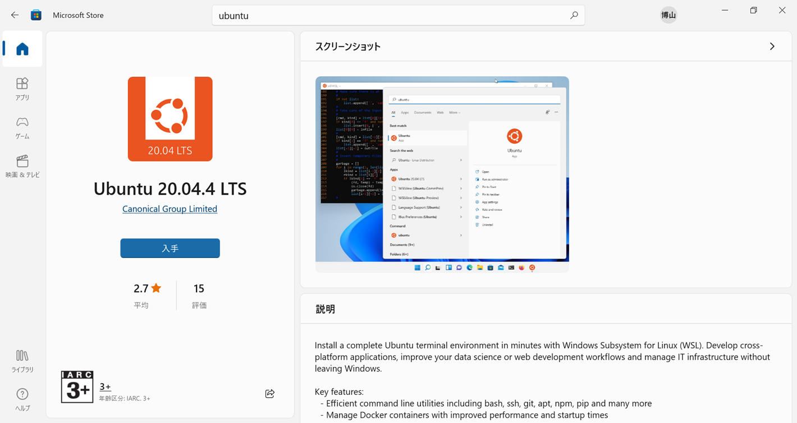

### Qimme2インストール

- Windows10での準備
    - Windowsの機能の有効化または無効化を実行
    - Linux用 Windowsサブシステムにチェック
- Ubuntuのインストール
    - Ubuntu 20.04.4 LTS
    
- Ubuntuでの準備
    - sudo apt-get update
    - sudo apt-get upgrade
    - curl -o https://repo,anaconda.com/archieve/Anaconda3-2020.11-Linux-x86_64.sh
    - sha256sum Anaconda3-2020.11-Linux-x86_64.sh
    - bash Anaconda3-2020.11-Linux-x86_64.sh
    - conda create --name my_env python=3
    - conda activate my_env
- Qiime2のインストール (https://docs.qiime2.org/2022.2/install/native/)
    - wget https://data.qiime2.org/distro/core/qiime2-2022.2-py38-linux-conda.yml    
    - conda env create -n qiime2-2022.2 --file qiime2-2022.2-py38-linux-conda.yml
    - rm qiime2-2022.2-py38-linux-conda.yml
- Qiime2の確認
    - conda activate qiime2-2022.2
    - qiime2 info

